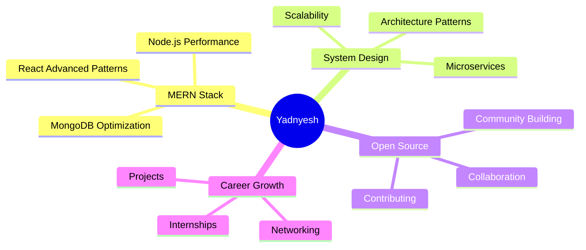

<div align="center">

  

  <p>
    
    
    
  </p>

  

</div>

---

## 👨‍💻 About Me

```typescript
const yadnyesh: Developer = {
  name: "Yadnyesh Badgujar",
  pronouns: "He/Him",
  location: "India 🇮🇳",
  education: "Computer Science @ IIIT Sricity",
  role: "Full Stack Web Developer",
  
  focus: [
    "Building scalable web applications",
    "Clean, maintainable code",
    "User-centric design",
    "Open source contributions"
  ],
  
  currentlyLearning: ["System Design", "Advanced React Patterns", "Microservices"],
  openToCollaborate: true,
  lookingFor: "Opportunities to build impactful solutions"
};
```

I'm a passionate **Computer Science undergraduate** at **IIIT Sricity** specializing in **MERN Stack Development**. I love crafting scalable, efficient web applications and contributing to open-source projects. Always eager to learn new technologies and collaborate on innovative solutions.

---

## 🚀 Tech Stack

### **Frontend**
<p>
  
  
  
  
  
</p>

### **Backend**
<p>
  
  
  
  
</p>

### **Tools & Technologies**
<p>
  
  
  
  
  
  
</p>

---

## 📊 GitHub Analytics

<div align="center">
  
  
</div>

<div align="center">
  
</div>

<div align="center">
  
</div>

---

## 🏆 GitHub Trophies

<div align="center">
  
</div>

---

## 💼 Featured Projects

<div align="center">

[](https://github.com/yadnyesh001)

</div>

> 💡 **Note:** Replace repository names above with your actual featured projects

---

## 🎯 Current Focus



---

## 📫 Connect With Me

<div align="center">

[](https://yadnyeshbadgujar.vercel.app/)
[](https://linkedin.com/in/yadnyeshbadgujar)
[](mailto:yadnyeshbadgujar@gmail.com)
[](https://twitter.com/yadnyesh001)
[](https://github.com/yadnyesh001)

</div>

---

## 💡 Fun Facts

- 🔭 Currently working on **full-stack web applications**
- 🌱 Learning **System Design** and **Advanced React Patterns**
- 👯 Looking to collaborate on **open source projects**
- 💬 Ask me about **MERN Stack, React, or Web Development**
- ⚡ Fun fact: **I debug better with coffee ☕**

---

## 📈 Contribution Activity

<!--START_SECTION:activity-->
<!--END_SECTION:activity-->

---

<div align="center">

### 🎓 Education
**Indian Institute of Information Technology, Sri City**  
*Bachelor of Technology in Computer Science*  
*Expected Graduation: 2026*

---

### 💭 Quote of the Day


---

### 👀 Profile Views


---

### ⭐ Show Some Love
**If you find my work valuable, please consider:**
- ⭐ Starring my repositories
- 🍴 Forking interesting projects
- 🤝 Following for updates
- 💬 Sharing feedback and suggestions

---


**✨ "Building the web, one commit at a time" ✨**

</div>
